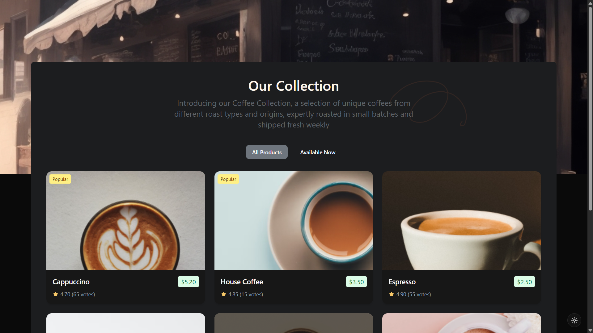

<h1 align="center">Simple Coffee Listing | devChallenges</h1>

   Solution for a challenge <a href="https://devchallenges.io/challenge/simple-coffee-listing" target="_blank">Simple Coffee Listing</a> from <a href="http://devchallenges.io" target="_blank">devChallenges.io</a>.

  <h3>
    <a href="https://coffee-listing-cyan.vercel.app/">
      Demo 
    </a>
     | 
    <a href="https://github.com/pius706975/devchallenges-simple-coffee-listing">
      Solution
    </a>
     | 
    <a href="https://devchallenges.io/challenge/simple-coffee-listing">
      Challenge
    </a>
  </h3>

## Table of Contents

- [Overview](#overview)
  - [What I learned](#what-i-learned)
- [Built with](#built-with)
- [Contact](#author)

## Overview

### What I learned
As a fullstack developer, I found that Vue is easier to understand than React, Next, even Angular. So Vue is recommended for beginners who just get started in frontend development with a framework.

### Built with
- [Vue.js](https://vuejs.org/)
- [Tailwind](https://tailwindcss.com/)
- [Shadcn Vue](https://www.shadcn-vue.com)
##

This application/site was created as a submission to a [DevChallenges](https://devchallenges.io/challenges-dashboard) challenge.

## Author

- Website [https://piusrestiantoro.vercel.app](https://piusrestiantoro.vercel.app)
- GitHub [@pius706975](https://github.com/pius706975)
